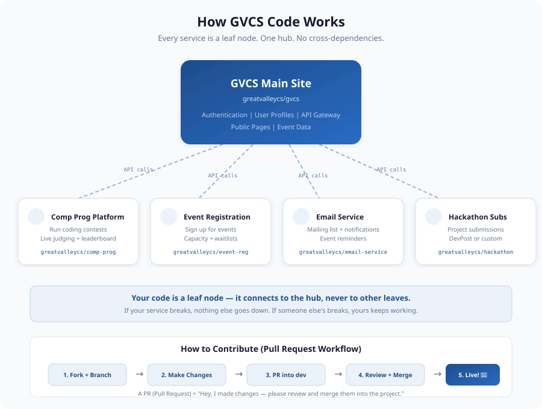

# GVCS - Great Valley Computer Science Club Website

The official website for the Great Valley CS Club. Built with Next.js, Tailwind CSS, and Framer Motion.

**Live site:** Deployed automatically via Vercel on every push to `master`.

## Tech Stack

- **Framework:** Next.js 16 (App Router)
- **Styling:** Tailwind CSS 4
- **Animations:** Framer Motion
- **Icons:** Lucide React
- **Deployment:** Vercel (auto-deploys from GitHub)

## Getting Started

```bash
npm install
npm run dev
```

Open http://localhost:3000 to see the site.

## Project Structure

```
src/
  app/
    page.tsx          # Home page (scroll-driven laptop hero)
    events/page.tsx   # Events listing page
    globals.css       # Design tokens (colors, fonts)
    layout.tsx        # Root layout with navbar
  components/
    Navbar.tsx        # Fixed top navigation
    ScrollVideo.tsx   # Scroll-driven laptop animation (96 frames)
    SponsorMarquee.tsx # Sponsor logo carousel
    EventCard.tsx     # Event display card
    SectionHeading.tsx # Section title component
public/
  frames/            # 96 JPG frames for scroll animation
  sponsors/          # Sponsor logo files (SVG + PNG)
```

## Architecture



The main site is the **hub** — it handles authentication and provides an API. Everything else (contest platform, event registration, email, etc.) is a **leaf node** that connects via API calls. Your code never depends on another contributor's code.

See [ARCHITECTURE.md](ARCHITECTURE.md) for the full breakdown.

## Contributing

See [CONTRIBUTING.md](CONTRIBUTING.md) for the full guide. The short version:

1. Fork the repo
2. Create a branch off `dev` (e.g. `feat/my-feature`)
3. Make your changes
4. Open a PR targeting `dev` (NOT `master`)
5. Test locally before submitting

## Branch Strategy

| Branch | Purpose |
|--------|---------|
| `master` | Production. Auto-deploys to live site. Never push directly. |
| `dev` | Testing branch. All PRs go here first. |
| `feat/*`, `fix/*`, `chore/*` | Your working branches. PR into `dev`. |
